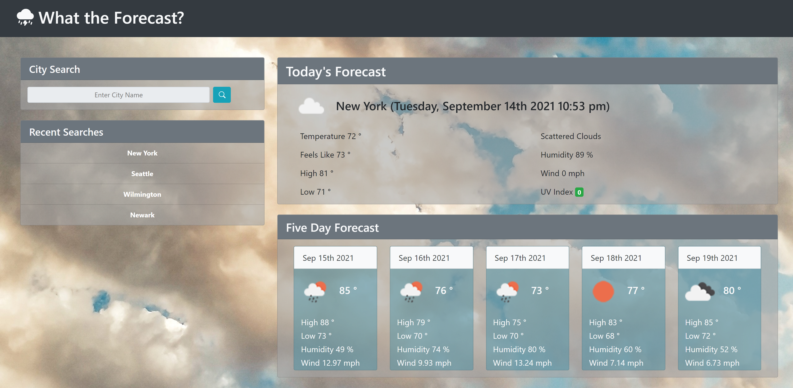
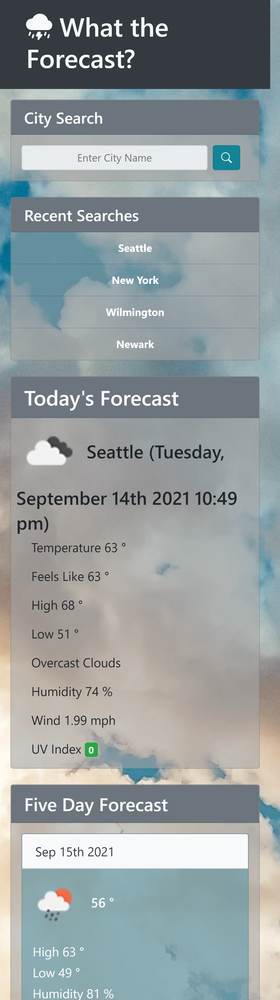

# Weather Dashboard

Link to deployed page: https://jl118.github.io/weather-dashboard/

## Overview and Functionality

This is an easy-to-use weather dashboard that allows the user to search for the forecast by city utilizing the OpenWeatherMap API. 

The current weather is shown in the largest section of the page, with an icon that changes with the conditions, along with the date and time. Below is the temperature, real-feel, high, and low temperatures. Next to that is the current condition, humidity, wind speed, and UV index that changes color to indicate the severity of the UV rays. 

Beneath the current forecast are cards displaying the five day expected forecast with weather condition icons, the daily temperature, the high and low, the humidity, and the wind speed. 

Up to five recent searches are saved to local storage for ease of use, and if the user wants to revisit any of their previous searches, they can click on the list and the forecast will populate without them having to type it out again. 

Technologies used:
- HTML5
- JavaScript
- Bootstrap
- Moment.js
- CSS3

## Layout

This site is mobile responsive, and will function on desktop and mobile screens

* Desktop Layout:
    

* Mobile Layout:
    